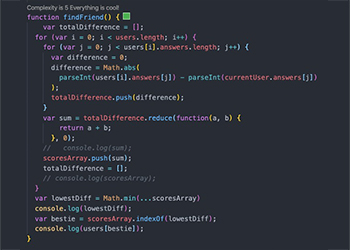

### FriendFinder

Welcome to FriendFinder, an app that will help you find your new best friend by simply answering ten questions.

## How It Works

FriendFinder requires node.js and express.js. After the questions are answered, the responses are then compared to the responses of other users. The user with the least amount of difference in their responses is the new best friend.

## Link to Deployed App
https://immense-taiga-31426.herokuapp.com/

## Link to Portfolio
https://purdyjen.github.io/Responsive-Portfolio/

